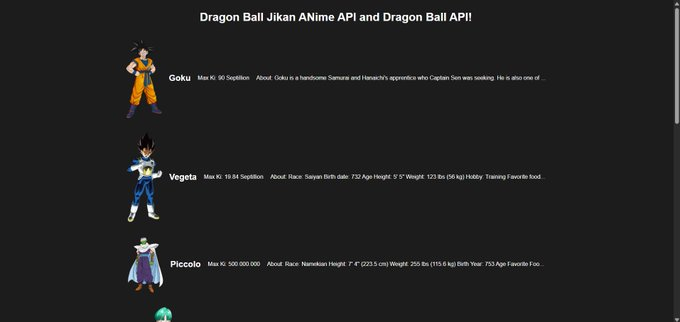

# Dragon Ball Jikan API and Dragon Ball API

This project gets a Dragon Ball characters name and maxKi (power level) from the Dragon Ball API, and in the Jikan API it gets that characters name from the Dragon Ball API and uses the Jikan API to put an about description in the frontend of every characters! 

## How It's Made:

**Tech used:** HTML, CSS, and JavaScript

I used html for the markup, css for the styling, andI used Javascript for the logic of this project.

## Lessons Learned:

I learned how to delay each request sent to the API by 1 second using the new Promise javascript object.  

## Image of Project:

